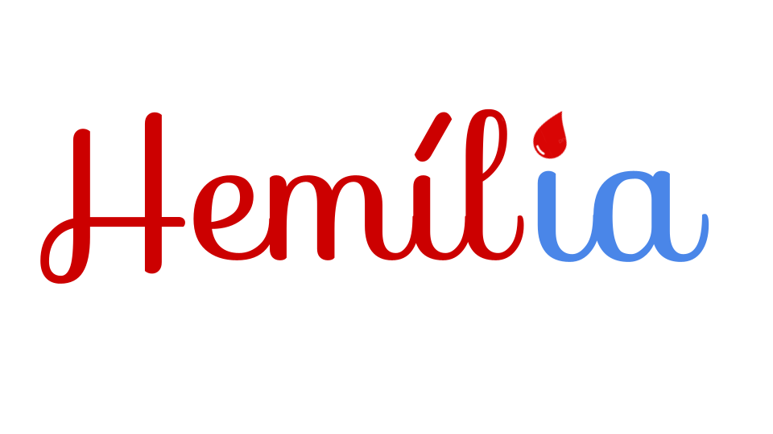

# HemílIA

Hemília é um assitente pessoal para obter informações úteis sobre o tratamento de Hemofilia.
Extraindo o conteúdo do Diário de Infusão fornecido pela Federação Brasileira de Hemofilia e disponibilizando de forma fácil e rápida.
A Hemília pode te auxiliar com informações sobre: 
- Primeiros Socorros;
- Quais medicações Recomendadas;
- Contra Indicações de Medicamentos;
- Hemocentros mais próximos.

