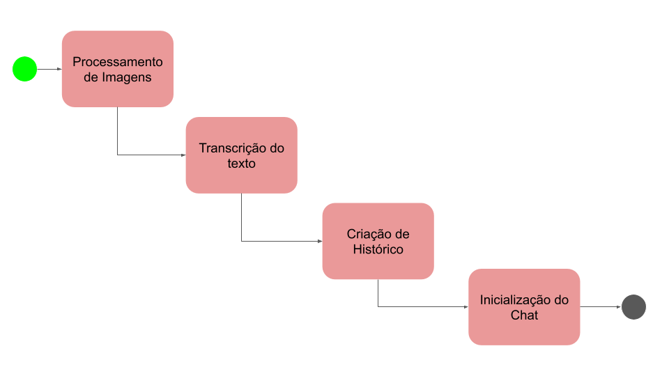
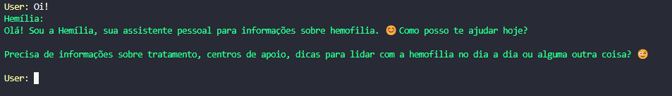
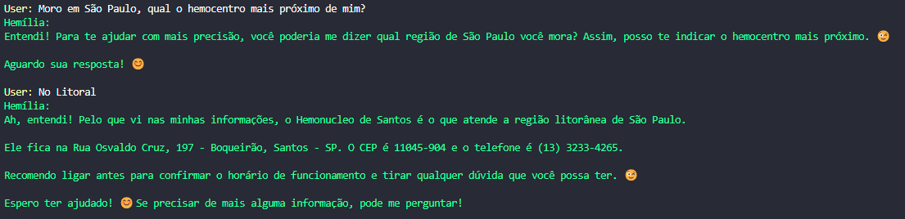
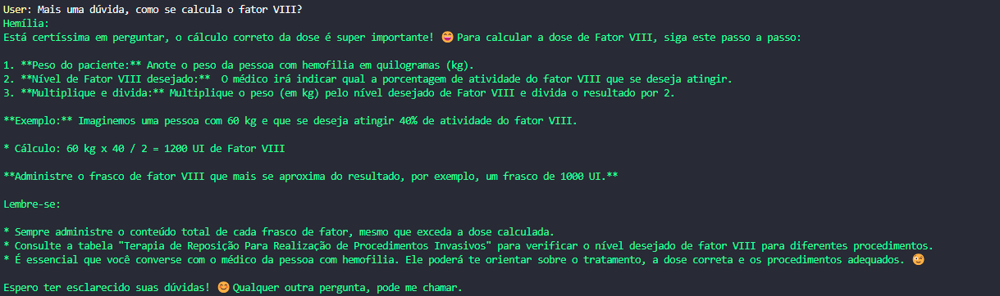
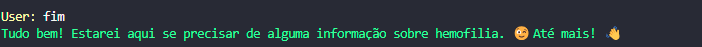

# Hemília

Hemília é um assitente pessoal para obter informações úteis sobre o tratamento de Hemofilia.
Extraindo o conteúdo do Diário de Infusão fornecido pela Federação Brasileira de Hemofilia e disponibilizando de forma fácil e rápida.
A Hemília pode te auxiliar com informações sobre: 
- Primeiros Socorros;
- Quais medicações Recomendadas;
- Contra Indicações de Medicamentos;
- Hemocentros mais próximos.

# Índice 

* [Descrição do Projeto](#descrição-do-projeto)
* [Metodologia](#metodologia)
* [Funcionalidades e Demonstração da Aplicação](#funcionalidades-e-demonstração-da-aplicação)
* [Tecnologias utilizadas](#tecnologias-utilizadas)

# Descrição do Projeto

Projeto desenvolvido para participação no Desafio Imersão IA promovido pela Alura e Google. Nele fomos apresentados ao GEMINI e ao Studio AI, ferramentas da Google para desenvolvimento de aplicações com a força e inovação das Liguagens e Modelos Generativos.

O Desafio era aplicar os conteúdo ensinados no curso em uma aplicação de sua prórpia autoria. Para o desafio foi criado uma assistente virtual para auxiliar pessoas que cuidam ou portam a Hemofilia. Com um apelo social a Hemília visa aplicar os conhecimentos de IA em uma aplicação prática e fácil de consultar. Em funcionalidades futuras também será possível utilizá-la como uma agenda pessoal.

# Metodologia

Para criar a aplicação seguimos os seguintes passos:
1. Processamento de Imagens:
    1. Foi utilizado a Biblioteca PIL para transformar a imagem no formato de Blob (Bytes).
    2. Fazendo uma varredura em todas as fotos tiradas do Diario de Infusão.
2. Com as imagens carregadas utilizamos modelo de Visão Computacional (GEMINI_PRO_VISION)  para fazer a transcrição da foto ou seja extrair o texto das fotos;
3. Com o texto em mãos, criamos uma lista contendo de histórico contendo toda informação coletada.
4. E na última etapa do processo, inicializamos o Modelo com a funcionalidade CHAT e passamos como entrada o Histórico criado, junto com as instruções de como Modelo deveria responder e agir;

# Funcionalidades e Demonstração da Aplicação

### Principais funcionalidades:
- Saber qual hemocentro mais próximo
- Quais medicamentos são recomendados
- Quais medicamentos não são recomendados
- Como calcular a quantidade do Fator

### Funcionalidades Futuras:
 - Lembrete de visita ao Hemocentro
 - Histórico de infusões
 - Estatistícas

### Demonstração da Aplicação

1. Clonar o projeto:

        git clone https://github.com/filipesant/hemilia.git

2. API_KEY:

    Não esqueça de substituir no código sua API_KEY obtida pelo Google Studio AI;

2. Baixar dependências do projeto:
        
        pip install -r requirements.txt

3. Executar aplicação:

        python main.py

### Prints

Você pode testar as seguintes perguntas:
- Fazer um cumprimento: Oi ou Olá

- Comentar que é de alguma cidade, e perguntar qual o hemocentro mais próximo;

- Perguntar como é feito cálculo de quantidade do fator:

- Digite "FIM" para finalizar;
